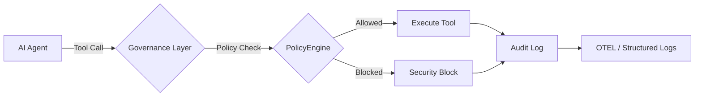

# 🚀 10 分鐘快速入門指南

從零開始，在 10 分鐘內構建受治理的 AI 智能體。

> **前置條件：** Python 3.10+ / Node.js 18+ / .NET 8.0+（任選其一或多個）

## 架構概述

治理層在執行前攔截每個智能體操作：



## 1. 安裝

安裝治理工具包：

```bash
pip install agent-governance-toolkit[full]
```

或安裝單獨的套件：

```bash
pip install agent-os-kernel        # 策略執行 + 框架整合
pip install agentmesh-platform     # 零信任身份 + 信任卡
pip install agent-governance-toolkit    # OWASP ASI 驗證 + 完整性 CLI
pip install agent-sre              # SLO、錯誤預算、混沌測試
pip install agentmesh-runtime       # 執行期監督 + 權限環
pip install agentmesh-marketplace      # 外掛生命週期管理
pip install agentmesh-lightning        # 強化學習訓練治理
```

### TypeScript / Node.js

```bash
npm install @microsoft/agent-governance-sdk
```

### .NET

```bash
dotnet add package Microsoft.AgentGovernance
```

如果您目前不在包含 `.csproj` 的目錄中，請明確傳入專案路徑：

```bash
dotnet add YourApp.csproj package Microsoft.AgentGovernance
```

在 Visual Studio 的 Package Manager Console 中，請先在 **Default project** 下拉選單中選取目標專案，再執行：

```powershell
Install-Package Microsoft.AgentGovernance
```

## 2. 驗證安裝

執行內建的驗證腳本：

```bash
python scripts/check_gov.py
```

或直接使用治理 CLI：

```bash
agent-governance verify
agent-governance verify --badge
```

## 3. 您的第一個受治理智能體

建立一個名為 `governed_agent.py` 的檔案：

```python
from agent_os.policies import PolicyEvaluator, PolicyDecision
from agent_os.policies.schema import (
    PolicyDocument, PolicyRule, PolicyCondition,
    PolicyAction, PolicyOperator, PolicyDefaults,
)

# 內嵌定義治理規則（或從 YAML 載入 — 見下文）
policy = PolicyDocument(
    name="agent-safety",
    version="1.0",
    description="範例安全策略",
    defaults=PolicyDefaults(action=PolicyAction.ALLOW),
    rules=[
        PolicyRule(
            name="block-dangerous-tools",
            condition=PolicyCondition(
                field="tool_name",
                operator=PolicyOperator.IN,
                value=["execute_code", "delete_file", "shell_exec"],
            ),
            action=PolicyAction.DENY,
            message="工具已被策略封鎖",
            priority=100,
        ),
    ],
)

evaluator = PolicyEvaluator(policies=[policy])

# 允許
result = evaluator.evaluate({"tool_name": "web_search", "input_text": "latest AI news"})
print(f"操作允許: {result.allowed}")   # True

# 封鎖 — 確定性
result = evaluator.evaluate({"tool_name": "delete_file", "input_text": "/etc/passwd"})
print(f"操作允許: {result.allowed}")   # False
print(f"原因: {result.reason}")       # "工具已被策略封鎖"
```

執行：

```bash
python governed_agent.py
```

## 4. 包裝現有框架

工具包與所有主要智能體框架整合：

```bash
pip install agentmesh-langchain      # LangChain 轉接器
pip install llamaindex-agentmesh     # LlamaIndex 轉接器
pip install crewai-agentmesh         # CrewAI 轉接器
```

支援的框架：**LangChain**、**OpenAI Agents SDK**、**AutoGen**、**CrewAI**、
**Google ADK**、**Semantic Kernel**、**LlamaIndex**、**Anthropic**、**Mistral**、**Gemini** 等。

## 5. 檢查 OWASP ASI 2026 覆蓋率

驗證您的部署是否涵蓋了 OWASP 智能體安全威脅：

```bash
agent-governance verify
agent-governance verify --json
agent-governance verify --badge
```

## 後續步驟

| 內容 | 位置 |
|------|------|
| 完整 API 參考（Python） | [agent-governance-python/agent-os/README.md](../../agent-governance-python/agent-os/README.md) |
| TypeScript 套件文件 | [agent-governance-typescript/README.md](../../agent-governance-typescript/README.md) |
| .NET 套件文件 | [agent-governance-dotnet/README.md](../../agent-governance-dotnet/README.md) |
| OWASP 覆蓋圖 | [../../docs/compliance/owasp-agentic-top10-architecture.md](../../docs/compliance/owasp-agentic-top10-architecture.md) |
| 貢獻指南 | [CONTRIBUTING.md](../../CONTRIBUTING.md) |

---

*基於 [@davidequarracino](https://github.com/davidequarracino) 的初始快速入門貢獻。*
