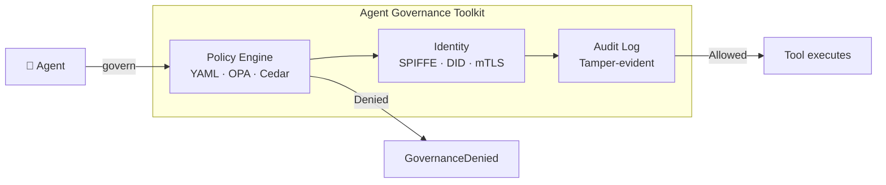

---
hide:
  - navigation
  - toc
---

<div class="agt-hero" markdown>

<div class="agt-hero-inner" markdown>

# Ship agents to production without losing sleep

<p class="agt-hero-subtitle">Policy enforcement, identity, sandboxing, and SRE for autonomous AI agents.<br>One <code>pip install</code>, any framework.</p>

<div class="agt-hero-cta">
  <a class="agt-btn agt-btn-ghost" href="https://github.com/microsoft/agent-governance-toolkit">
    <svg viewBox="0 0 16 16" width="16" height="16" aria-hidden="true"><path fill="currentColor" d="M8 0C3.58 0 0 3.58 0 8a8 8 0 005.47 7.59c.4.07.55-.17.55-.38 0-.19-.01-.82-.01-1.49-2.01.37-2.53-.49-2.69-.94-.09-.23-.48-.94-.82-1.13-.28-.15-.68-.52-.01-.53.63-.01 1.08.58 1.23.82.72 1.21 1.87.87 2.33.66.07-.52.28-.87.51-1.07-1.78-.2-3.64-.89-3.64-3.95 0-.87.31-1.59.82-2.15-.08-.2-.36-1.02.08-2.12 0 0 .67-.21 2.2.82a7.42 7.42 0 014 0c1.53-1.04 2.2-.82 2.2-.82.44 1.1.16 1.92.08 2.12.51.56.82 1.27.82 2.15 0 3.07-1.87 3.75-3.65 3.95.29.25.54.73.54 1.48 0 1.07-.01 1.93-.01 2.2 0 .21.15.46.55.38A8.013 8.013 0 0016 8c0-4.42-3.58-8-8-8z"/></svg>
    GitHub
  </a>
  <a class="agt-btn agt-btn-solid" href="quickstart/">Quick Start</a>
</div>

<div class="agt-hero-install" markdown>

```bash
pip install agent-governance-toolkit[full]
```

</div>

<div class="agt-hero-actions">
  <a class="agt-action" href="https://pypi.org/project/agent-governance-toolkit/">
    <span class="agt-action-label">PyPI</span>
    <svg viewBox="0 0 16 16" width="14" height="14" aria-hidden="true"><path fill="currentColor" d="M3.5 3.5h6a.5.5 0 010 1H4.707l8.147 8.146a.5.5 0 01-.708.708L4 5.207V10a.5.5 0 01-1 0V4a.5.5 0 01.5-.5z"/></svg>
  </a>
  <a class="agt-action" href="tutorials/">
    <span class="agt-action-label">Tutorial</span>
    <svg viewBox="0 0 16 16" width="14" height="14" aria-hidden="true"><path fill="currentColor" d="M3.5 3.5h6a.5.5 0 010 1H4.707l8.147 8.146a.5.5 0 01-.708.708L4 5.207V10a.5.5 0 01-1 0V4a.5.5 0 01.5-.5z"/></svg>
  </a>
  <a class="agt-action" href="reference/comparison/">
    <span class="agt-action-label">How AGT Compares</span>
    <svg viewBox="0 0 16 16" width="14" height="14" aria-hidden="true"><path fill="currentColor" d="M3.5 3.5h6a.5.5 0 010 1H4.707l8.147 8.146a.5.5 0 01-.708.708L4 5.207V10a.5.5 0 01-1 0V4a.5.5 0 01.5-.5z"/></svg>
  </a>
</div>

<div class="agt-stats">
  <div class="agt-stat"><span class="agt-stat-value">3,700+</span><span class="agt-stat-label">GitHub Stars</span></div>
  <div class="agt-stat"><span class="agt-stat-value">10</span><span class="agt-stat-label">Formal Specs</span></div>
  <div class="agt-stat"><span class="agt-stat-value">5</span><span class="agt-stat-label">Languages</span></div>
  <div class="agt-stat"><span class="agt-stat-value">19</span><span class="agt-stat-label">Integrations</span></div>
</div>

</div>

</div>

<div class="agt-section" markdown>

## The problem

Your AI agents call tools, browse the web, query databases, and delegate to other agents. Once deployed, they make decisions autonomously. You need answers to three questions:

**1. Is this action allowed?** An agent with access to `send_email` and `query_database` should not be able to `drop_table`. OAuth scopes and IAM roles control which services an agent can reach, not what it does once connected.

**2. Which agent did this?** In a multi-agent system, five agents might share a single API key. When something goes wrong, "an agent did it" is not an incident response.

**3. Can you prove what happened?** Auditors and regulators need tamper-evident records of every decision: what policy was active, what the agent requested, and why it was allowed or denied.

</div>

<div class="agt-section" markdown>

## Govern any agent in 2 lines

Wrap any tool function with `govern()`. Policy enforcement, audit logging, and denial handling are automatic.

```python
from agentmesh.governance import govern

safe_tool = govern(my_tool, policy="policy.yaml")
```

That's it. `safe_tool` evaluates your YAML policy on every call, logs the decision, and raises `GovernanceDenied` if the action is blocked. Works with LangChain, CrewAI, OpenAI Agents, AutoGen, Google ADK, and any other framework.

```yaml
# policy.yaml
apiVersion: governance.toolkit/v1
name: production-policy
default_action: allow
rules:
  - name: block-destructive
    condition: "action.type in ['drop', 'delete', 'truncate']"
    action: deny
    description: "Destructive operations require human approval"

  - name: require-approval-for-send
    condition: "action.type == 'send_email'"
    action: require_approval
    approvers: ["security-team"]
```

```
>>> safe_tool(action="read", table="users")
{'table': 'users', 'rows': 42}

>>> safe_tool(action="drop", table="users")
GovernanceDenied: Action denied by policy rule 'block-destructive':
  Destructive operations require human approval
```

</div>

<div class="agt-section" markdown>

## How it works



Every layer is optional. Start with `govern()` and add layers as your risk profile grows. Most teams run policy enforcement + audit logging and never need the full stack.

</div>

<div class="agt-section" markdown>

## Packages

<div class="agt-cards">
<a class="agt-card" data-pkg="os" href="packages/agent-os/">

<span class="agt-card-body"><span class="agt-card-title">Agent OS</span>
<span class="agt-card-desc">Policy engine, agent lifecycle, governance gate</span></span>
</a>
<a class="agt-card" data-pkg="mesh" href="packages/agent-mesh/">

<span class="agt-card-body"><span class="agt-card-title">Agent Mesh</span>
<span class="agt-card-desc">Agent discovery, routing, and trust mesh</span></span>
</a>
<a class="agt-card" data-pkg="runtime" href="packages/agent-runtime/">

<span class="agt-card-body"><span class="agt-card-title">Agent Runtime</span>
<span class="agt-card-desc">Execution sandboxing with four privilege rings</span></span>
</a>
<a class="agt-card" data-pkg="sre" href="packages/agent-sre/">

<span class="agt-card-body"><span class="agt-card-title">Agent SRE</span>
<span class="agt-card-desc">Kill switch, SLO monitoring, chaos testing</span></span>
</a>
<a class="agt-card" data-pkg="compliance" href="packages/agent-compliance/">

<span class="agt-card-body"><span class="agt-card-title">Agent Compliance</span>
<span class="agt-card-desc">OWASP verification, policy linting, integrity checks</span></span>
</a>
<a class="agt-card" data-pkg="marketplace" href="packages/agent-marketplace/">

<span class="agt-card-body"><span class="agt-card-title">Agent Marketplace</span>
<span class="agt-card-desc">Plugin governance and trust scoring</span></span>
</a>
<a class="agt-card" data-pkg="lightning" href="packages/agent-lightning/">

<span class="agt-card-body"><span class="agt-card-title">Agent Lightning</span>
<span class="agt-card-desc">RL training governance with violation penalties</span></span>
</a>
<a class="agt-card" data-pkg="hypervisor" href="packages/agent-hypervisor/">

<span class="agt-card-body"><span class="agt-card-title">Agent Hypervisor</span>
<span class="agt-card-desc">Execution audit, delta engine, commitment anchoring</span></span>
</a>
<a class="agt-card" data-pkg="acs" href="packages/agent-control-specification/">

<span class="agt-card-body"><span class="agt-card-title">Agent Control Specification</span>
<span class="agt-card-desc">Stateless policy decisions for agent security</span></span>
</a>
</div>
</div>

<div class="agt-section" markdown>

## Language SDKs

| SDK | Install |
|-----|---------|
| 🐍 [Python](packages/agent-compliance.md) | `pip install agent-governance-toolkit[full]` |
| 📘 TypeScript | `npm install @microsoft/agent-governance-sdk` |
| 🔷 [.NET](packages/dotnet-sdk.md) | `dotnet add package Microsoft.AgentGovernance` |
| 🦀 Rust | `cargo add agent-governance` |
| 🐹 Go | `go get github.com/microsoft/agent-governance-toolkit/agent-governance-golang` |

</div>

<div class="agt-section" markdown>

## Framework Integrations

Works with any agent framework: LangChain, CrewAI, AutoGen, Google ADK, OpenAI Agents, LlamaIndex, Haystack, Mastra, MCP, A2A, and more. See the [full list](packages/index.md).

</div>

<div class="agt-section" markdown>

## Examples

| Example | Framework | What it demonstrates |
|---------|-----------|---------------------|
| [openai-agents-governed](https://github.com/microsoft/agent-governance-toolkit/tree/main/examples/openai-agents-governed) | OpenAI Agents SDK | Policy-gated tool calls with trust tiers |
| [crewai-governed](https://github.com/microsoft/agent-governance-toolkit/tree/main/examples/crewai-governed) | CrewAI | Multi-agent governance with role-based policies |
| [smolagents-governed](https://github.com/microsoft/agent-governance-toolkit/tree/main/examples/smolagents-governed) | HuggingFace smolagents | Lightweight agent governance |
| [maf-integration](https://github.com/microsoft/agent-governance-toolkit/tree/main/examples/maf-integration) | MAF | Microsoft Agent Framework integration |
| [mcp-trust-verified-server](https://github.com/microsoft/agent-governance-toolkit/tree/main/examples/mcp-trust-verified-server) | MCP | Trust-verified MCP server implementation |

</div>

<div class="agt-section" markdown>

## Specifications

Every major component has a formal RFC 2119 specification with conformance tests.

| Specification | Tests |
|---|---|
| [Agent OS Policy Engine](specs/AGENT-OS-POLICY-ENGINE-1.0.md) | 68 |
| [Agent Control Specification](packages/agent-control-specification.md) | -- |
| [AgentMesh Identity and Trust](specs/AGENTMESH-IDENTITY-TRUST-1.0.md) | 135 |
| [Agent Hypervisor Execution Control](specs/AGENT-HYPERVISOR-EXECUTION-CONTROL-1.0.md) | 80 |
| [AgentMesh Trust and Coordination](specs/AGENTMESH-TRUST-COORDINATION-1.0.md) | 62 |
| [Agent SRE Governance](specs/AGENT-SRE-GOVERNANCE-1.0.md) | 111 |
| [MCP Security Gateway](specs/MCP-SECURITY-GATEWAY-1.0.md) | 127 |
| [Agent Lightning Fast-Path](specs/AGENT-LIGHTNING-FAST-PATH-1.0.md) | 100 |
| [Framework Adapter Contract](specs/FRAMEWORK-ADAPTER-CONTRACT-1.0.md) | 152 |
| [Audit and Compliance](specs/AUDIT-COMPLIANCE-1.0.md) | 157 |
| [AgentMesh Wire Protocol](specs/AGENTMESH-WIRE-1.0.md) | -- |

[25 Architecture Decision Records](adr/) document the reasoning behind key design choices.

</div>

<div class="agt-section" markdown>

## Standards Compliance

| Standard | Coverage |
|----------|----------|
| [OWASP Agentic AI Top 10](compliance/owasp-agentic-top10-architecture.md) | All ASI risk categories mapped with deterministic controls |
| [NIST AI RMF 1.0](reference/nist-rfi-mapping.md) | Full GOVERN, MAP, MEASURE, MANAGE alignment |
| [EU AI Act](compliance/) | Compliance mapping with automated evidence |
| [SOC 2](compliance/soc2-mapping.md) | Control mapping with audit trail export |

</div>
